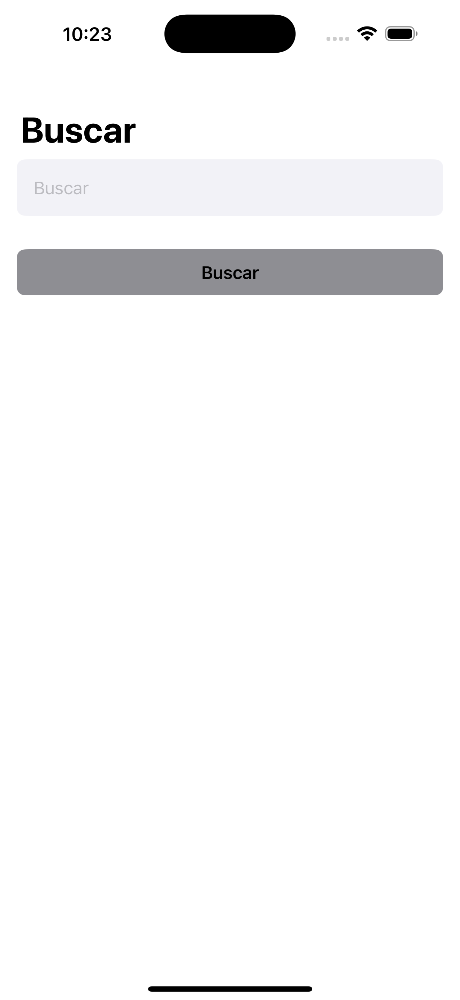
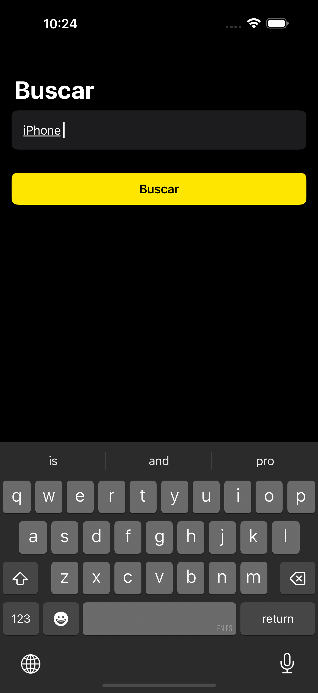
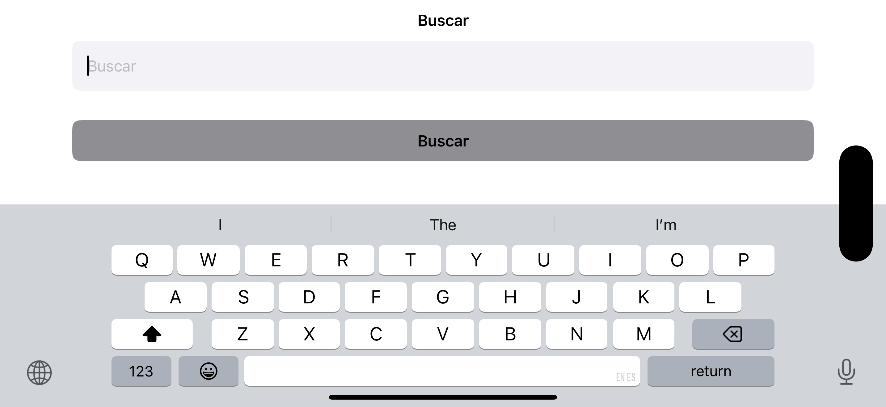
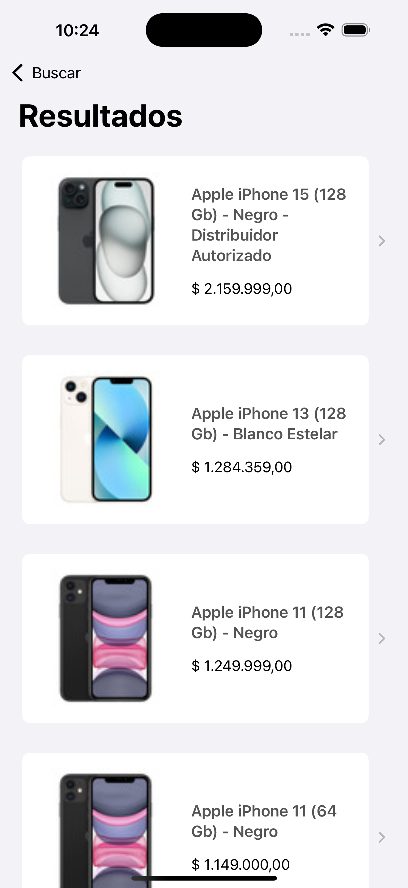
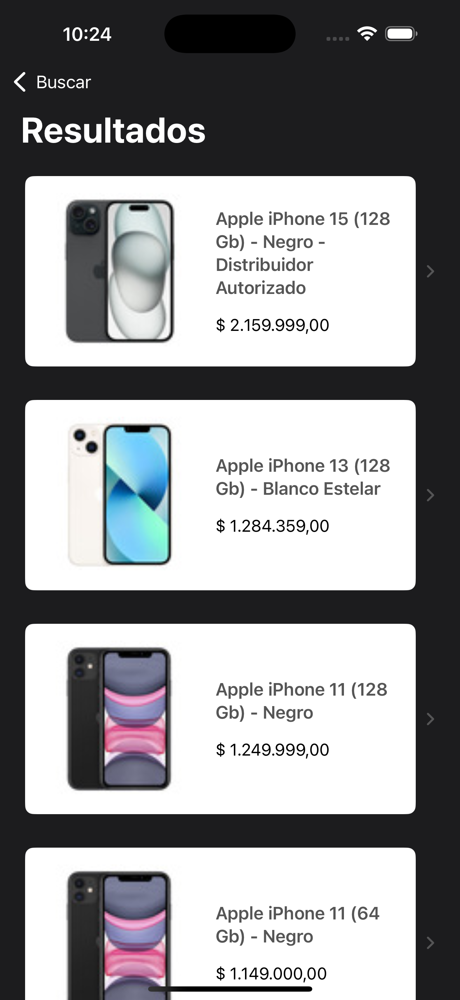
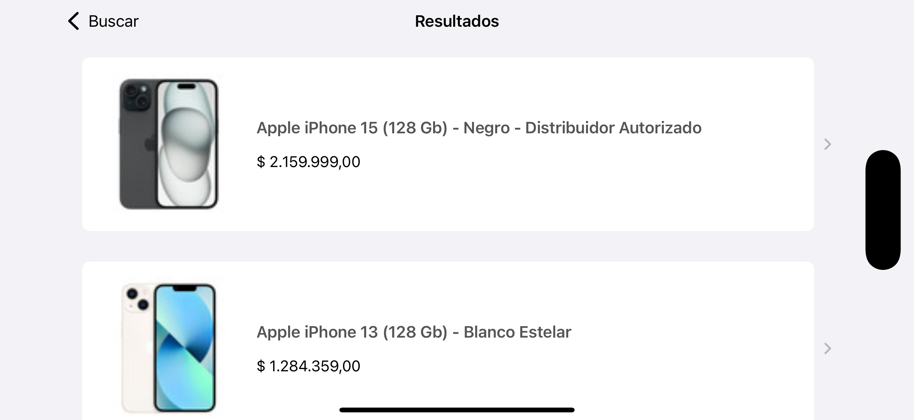
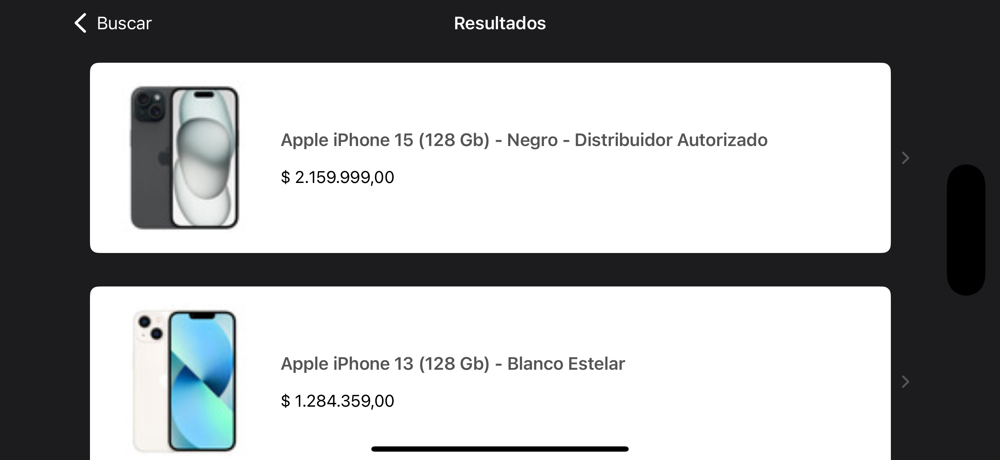
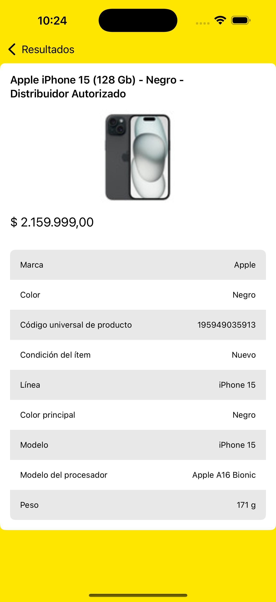
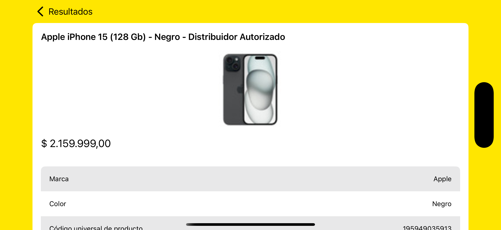

# 📱 MercadoLibre Explorer  

MercadoLibre Explorer es una aplicación desarrollada en **SwiftUI** que permite buscar productos en MercadoLibre utilizando su API.  

---

## 🚀 Características  

- 🔎 **Búsqueda de productos en MercadoLibre** con una interfaz intuitiva.  
- 📋 **Lista de resultados** con información detallada de cada producto.  
- 🛍 **Vista de detalles** que muestra atributos clave del producto.  
- 🎨 **Interfaz adaptativa** optimizada para diferentes tamaños de pantalla y orientación.  
- 🌙 **Modo claro y oscuro** para mejor experiencia visual.  

---

## 📸 Screenshots  

A continuación, se presentan capturas de pantalla en diferentes dispositivos, modos de color y orientaciones.  

### 📌 Pantalla de Búsqueda  
| Modo Claro | Modo Oscuro |
|------------|------------|
|  |  |
|  |  |

---

### 📌 Lista de Productos  
| Modo Claro - Portrait | Modo Oscuro - Portrait |
|----------------------|----------------------|
|  |  |

| Modo Claro - Landscape | Modo Oscuro - Landscape |
|----------------------|----------------------|
|  |  |

---

### 📌 Detalle del Producto  
| Modo Vertical | Modo Horizontal |
|--------------|----------------|
|  |  |

---

## ⚙️ Instalación  

1. Clona este repositorio:  
   ```sh
   git clone https://github.com/Akelbarbosa/MercadoLibre-Explorer.git
   cd MercadoLibre-Explorer
